本文介绍了一种任务调度引擎，基于petri网模型设计，由网易乐得技术团队自主研发，可以适用于较为复杂的任务流程调度。

## 一、任务调度需求

在实际项目中，经常遇到开发自动执行的任务并进行任务调度的需求，总结下来，在这些需求中对任务的执行有如下一些要求。

### 1. 定时/延时执行
有的任务需要定时去执行，这里说的定时，首先包括固定的时间点，如每小时的0分0秒；其次还包括固定的时间间隔，如每隔1小时执行一次，具体执行时间点不固定。

而定时执行的任务就会存在一个问题，就是这次任务执行的时候，上一次的任务可能还没有执行完。所以有些任务的执行需求是当这个任务执行完之后再间隔多长时间去执行，这种执行方式称为延时执行。


### 2. 失败重试机制

任务执行失败之后，要有重试机制，可以设定重试次数和重试的时间间隔。

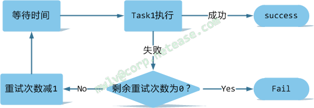

### 3. 前置/后置条件

对每一个任务，可以设置前置和后置条件，在任务执行时，先判断满不满足前置条件，如果满足再执行该任务；当任务执行完，去检查满不满足后置条件，如果不满足，则认为该任务执行失败，稍后再重试执行。

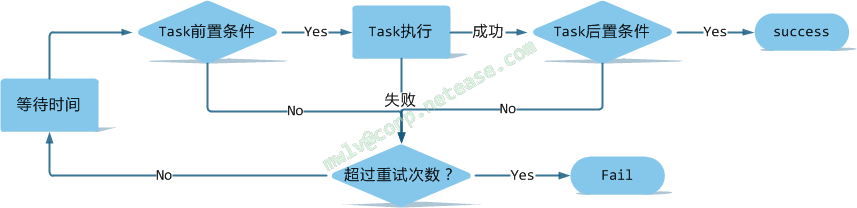

### 4. 任务流程调度

当系统中有多个任务，多个任务的执行之间有相互关联时，需要有任务的调度。最简单的就是一个任务执行完之后，去执行另一个任务，或等待一段时间之后去执行另一个任务。

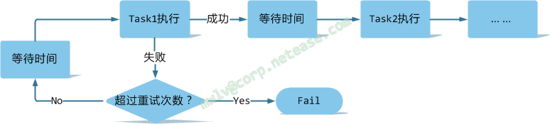

稍复杂一些的场景，如一个任务执行完之后，并发执行多个任务；或者多个任务全部执行完之后，再去执行一个任务。

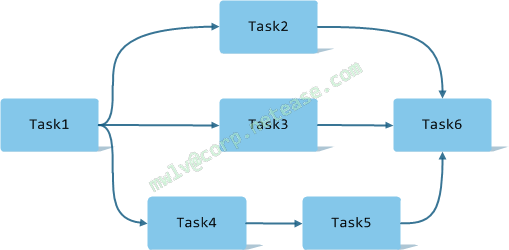

## 二、现有技术实现

### 1. linux操作系统中的crontab

将系统中的任务暴露出对外可以调用的接口，然后使用linux操作系统中的crontab命令来制定任务的执行计划，最终由系统中的守护进程crond执行任务的调用。

### 2. jdk中的Timer、ScheduledThreadPoolExecutor等

jdk中也提供了一些可以用来做任务调度的工具，早期的如java.util.Timer，使用Timer实现任务调度的核心类是Timer和TimerTask。其中Timer负责设定 TimerTask的起始与间隔执行时间。使用者只需要创建一个TimerTask 的继承类，实现自己的run方法，然后将其丢给Timer去执行即可。

Timer的优点在于简单易用，但由于所有任务都是由同一个线程来调度，因此所有任务都是串行执行的，同一时间只能有一个任务在执行，前一个任务的延迟或异常都将会影响到之后的任务。

JDK 5.0以后推荐使用java.util.concurrent.ScheduledThreadPoolExecutor。其设计思想是，每一个被调度的任务都会由线程池中一个线程去执行，因此任务是并发执行的，相互之间不会受到干扰。

### 3. 第三方的Quartz

Quartz是OpenSymphony开源组织在任务调度领域的一个开源项目，完全基于Java实现。作为一个优秀的开源调度框架，Quartz具有以下特点：

- 强大的调度功能，例如支持丰富多样的调度方法，可以满足各种常规及特殊需求
- 灵活的应用方式，例如支持任务和调度的多种组合方式，支持调度数据的多种存储方式
- 分布式和集群能力

另外，作为Spring默认的调度框架，Quartz很容易与Spring集成实现灵活可配置的调度功能。

### 4. 网易乐得ntes-cron定时任务执行组件

ntes-cron是网易乐得自主开发的一个定时任务执行组件，暂时还未开源和对外使用，功能强大，支持任务的持久化配置，支持多种执行方式配置，结合zookeeper实现分布式功能。


**总结**：纵观上面所列的实现技术，对于任务的定时执行都是支持的，但是对于多任务之间的调度普遍支持的弱一些或根本不支持。

## 三、petri网介绍

### 1.petri网概述
Petri网是对离散并行系统的数学表示，它是1960年代由Carl Adam Petri发明的，适合于描述异步的、并发的计算机系统模型。Petri网既有严格的数学表述方式，也有直观的图形表达方式，既有丰富的系统描述手段和系统行为分析技术，又为计算机科学提供了坚实的概念基础。由于Petri网能表达并发的事件，被认为是自动化理论的一种。研究领域趋向认为Petri网是所有流程定义语言之母。

### 2.petri网组成
经典的Petri网是简单的过程模型，由库所和变迁，有向弧以及令牌等元素组成。Petri网的元素包括：

- 库所（Place）——圆形节点
- 变迁（Transition）——方形节点
- 有向弧（Connection）——库所和变迁之间的有向弧
- 令牌（Token）——库所中的动态对象，可以从一个库所移动到另一个库所

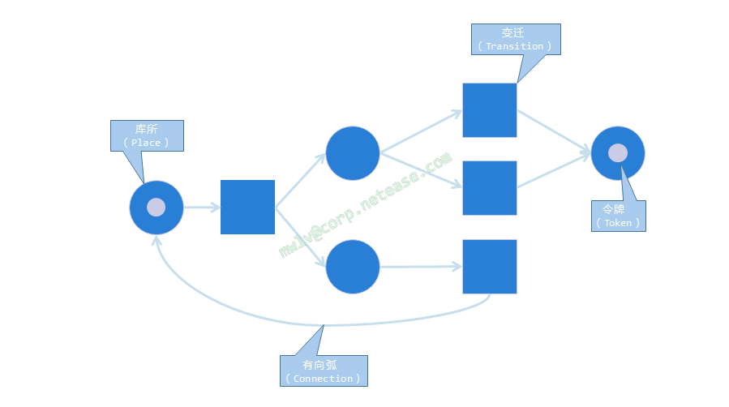

### 3.petri网的规则
- 有向弧是有方向的
- 两个库所或变迁之间不允许有弧，也就是说一个库所的前后只能是变迁，一个变迁的前后只能是库所
- 库所可以拥有任意数量的令牌

### 4.petri网的变迁行为
如果一个变迁的每个输入库所（input place）都拥有令牌，该变迁即为被允许（enable）。一个变迁被允许时，变迁将发生（fire），输入库所（input place）的令牌被消耗，同时为输出库所（output place）产生令牌。

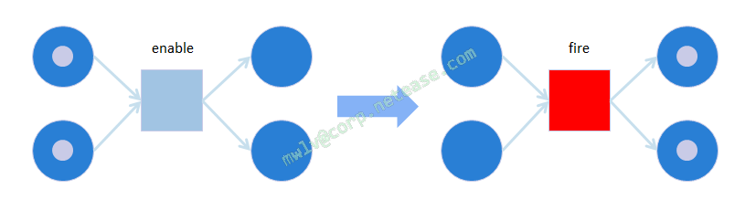

### 5.变迁发生的规则

- 变迁的发生是原子的，也就是说，没有一个变迁只发生了一半的可能性。
- 有两个变迁都被允许的可能，但是一次只能发生一个变迁，这种情况下变迁发生的顺序没有定义。

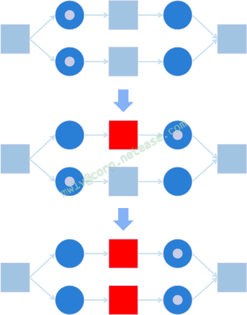

- 如果出现一个变迁，其输入库所的个数与输出库所的个数不相等，令牌的个数将发生变化，令牌数目不是守恒的。

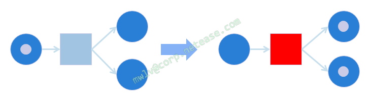

- Petri网络是静态的，网络中的库所、变迁和有向弧的连接关系在网络建立之后是不能再改变的。
- Petri网的状态由令牌在库所的分布决定，变迁发生完毕、下一个变迁等待发生的时候才有确定的状态，正在发生变迁的时候是没有一个确定的状态的。
- 两个变迁争夺一个令牌的情形被称之为冲突，当发生冲突的时候，由于Petri网的时序是不确定的，因此具体哪个变迁得以发生也是不确定的。实际应用中，往往需要避免这种情形。
- 多个弧连接两个节点的情况，在输入库所和变迁之间的弧的个数决定了该变迁变为被允许需要的令牌的个数，弧的个数决定了消耗/产生的令牌的个数。

### 6.petri网的优缺点
- 优点
    - 理论基础好，理论体系完善，目前有大量的论文和课题是有关PetriNet的研究，资料较完整。
    - 模型适合模拟包含阻塞、多线程的情况。
    - 模型已在电信等领域有实际的小范围应用。
    - 对于不复杂的情况建模，模型的实现门槛低，不是很复杂。

- 缺点
    - 对于复杂情况的模拟通常造成模型比较大，但是对于目前项目的模拟， 这点可以忽略。
    - 在市面上，模型大多没有大规模应用于工业应用，目前的开源产品也大都没有广泛的工业应用。

**总结**：鉴于petri网的以上特性，使用它作为任务调度引擎的基础模型可以说绰绰有余，而事实上经典的petri网模型就已经可以满足项目中所有的任务调度需求。

## 四、引擎设计与实现
任务调度引擎基于petri网模型设计，引擎只实现了经典Petri网的功能，该模型已经完全能满足目前团队项目的几乎全部所需场景和未来的扩张需要。

主要设计思路是将系统中的自动任务映射到petri网中的变迁节点Transition，再在两个变迁节点之间加上库所Place和有向弧Arc将其连接成网。当一个变迁发生时，就去执行该变迁对应的任务，任务执行成功后，在该变迁下游的库所中生成令牌，按照新生成的令牌再去发生新的变迁。

引擎基于spring框架之上开发，用到了spring的依赖注入、BeanPostProcessor、ReflectionUtils等功能。

整个任务调度引擎的设计分为如下几个层次：流程配置层、配置解析层、模型模拟层以及任务处理层。
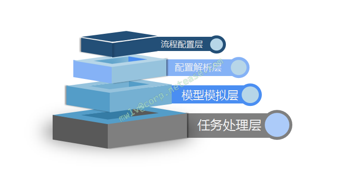


### 1.流程配置层
流程配置层提供对任务流程配置的支持，当前的版本中任务流程使用java注解进行配置，之后的版本中还会支持使用xml的配置。

在配置中主要用到的注解有：

 - @Template——加在类上，表示该类为任务流程配置类
 - @Node——加在方法上，表示该方法为任务节点
    - name 任务节点名称，在一个类的Node中必须唯一
    - next 该任务执行完之后要执行的任务节点
    - previous 该任务执行之前要执行的任务节点
    - fixedDelay 执行该任务的固定延迟时间
    - retryTimes 任务失败重试次数
    - retryDelay 失败重试的延迟时间
    - preCondition 该任务执行的前置条件
    - postCondition 该任务执行的后置条件
    - delay 执行该任务的延时时间方法
 - @Condition——加在方法上，表示执行下一节点需要满足的条件
    - name 条件方法名称，在一个类的Condition中必须唯一
 - @Delay——加在方法上，表示执行下一节点需要等待的延迟
   - name 延迟时间方法名称，在一个类的Delay中必须唯一

在该层中配置任务流程，可以使用上面的注解设置任务的名称、执行延迟时间、重试次数、前置/后置条件以及多个任务间的关联关系等。

一个简单的配置代码如下：


```
@Template
@Component("sampleTemplate")
@Scope("prototype")
public class SampleTemplate implements ProcessTemplate
{

    @Node(name = "n00", next = "[n01,(c02:n02,c03:n03)]", preCondition = "c04", delay = "d1")
    public String node00()
    {
        System.out.println("执行节点n00执行任务");
        return ProcessTemplate.SUCCESS;
    }

    @Node(name = "n01", fixedDelay = 2000, retryTimes = 10, retryDelay = 1000)
    public String node01()
    {
        System.out.println("执行节点n01执行任务");
        return ProcessTemplate.SUCCESS;
    }

    @Node(name = "n02", postCondition = "c04")
    public String node02()
    {
        System.out.println("执行节点n02执行任务");
        return ProcessTemplate.SUCCESS;
    }

    @Node(name = "n03")
    public String node03()
    {
        System.out.println("执行节点n03执行任务");
        return ProcessTemplate.SUCCESS;
    }

    @Node(name = "n04", previous = "[n01,n03]")
    public String node04()
    {
        System.out.println("执行节点n04执行任务");
        return ProcessTemplate.SUCCESS;
    }

    @Condition(name = "c02")
    public boolean condition2()
    {
        return false;
    }

    @Condition(name = "c03")
    public boolean condition3()
    {
        return true;
    }

    @Condition(name = "c04")
    public boolean condition4()
    {
        return true;
    }

    @Delay(name = "d1")
    public long delay1()
    {
    	return 1000;
    }

    @Override
    public String[] initStatus()
    {
    	return new String[]
    	{ "n00" };
    }

    @Override
    public boolean isFinished()
    {
    	return true;
    }

    @Override
    public String getInstanceId()
    {
    	return "sample";
    }

}

```
一个任务流程配置类需要继承ProcessTemplate类，需要实现三个方法：
- initStatus()：任务开始的节点
- isFinished()：流程是否结束的判断
- getInstanceId()：流程实例名字

该层针对多个任务之间的关联关系的表示提供了一种形式化描述方法：

- 使用“[]”描述可并行任务节点组合，如：[n01,n02]表示n01、n02两个任务节点为同时执行的并行关系
- 使用“()”描述条件选择的节点组合，其中(c01:n03,c02:n04)表示如果满足条件c01，则执行n03，如果满足c02，则执行n04

使用这样的形式化描述方法可以表示比较复杂的任务流程关系，如：[n01,(c01:n02,c02:[n03,n04]),n05]

如果用流程图来表示是这样的：

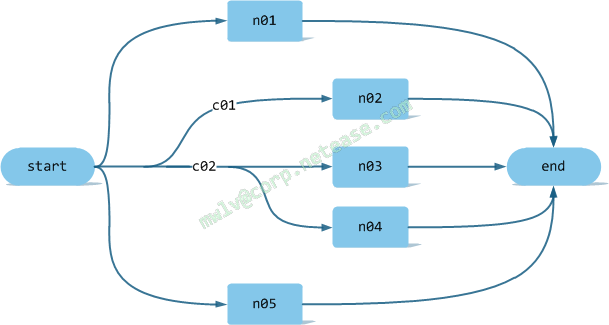

### 2.配置解析层
在配置解析层中进行流程配置的解析工作，将配置的任务流程解析成对应的javabean。

该层使用java的反射技术来识别、验证和解析流程配置。注解、解析器和生成的javabean之间的对应关系如下图。

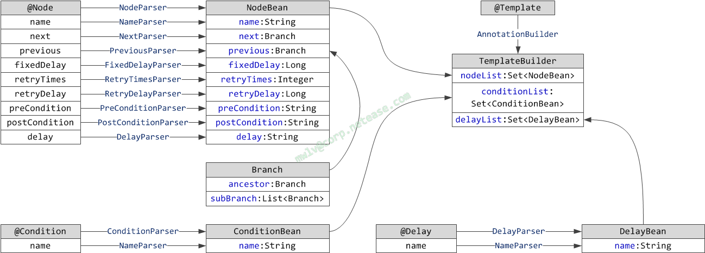


### 3.模型模拟层
在模型模拟层中先对上一层生成的javabean进行组装，生成petri网，然后再对生成的petri网的行为进行模拟，主要模拟令牌（Token）的消耗/产生以及变迁（Transition）的发生。因为任务对应在了变迁节点，所以变迁发生时会将映射在该变迁节点上的任务交给下面的任务处理层来执行。

该层中通过递归的方式构建图中的节点以及节点的上下游节点和所需的有向边，配置解析层生成的javabean和模型模拟层的petri网模型之间的对应转化关系如图。

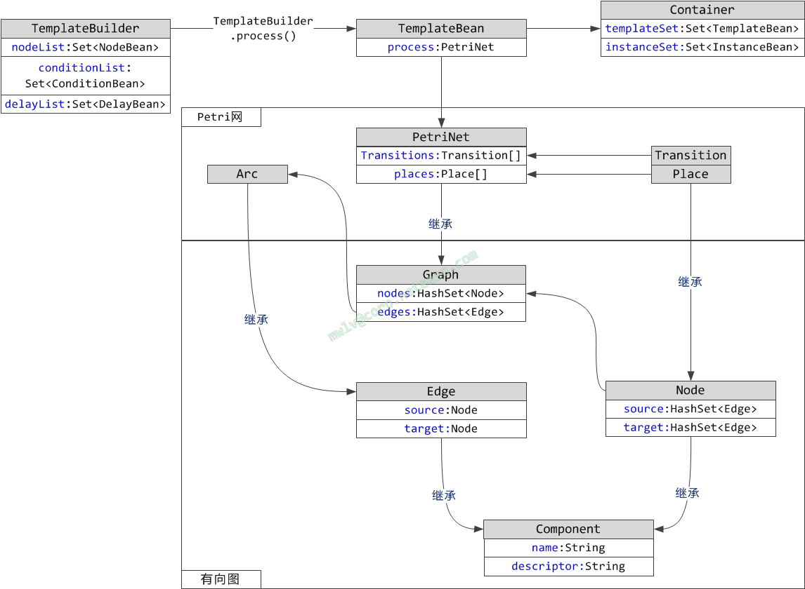

在这里由流程配置生成了TemplateBean对象，其中保存着构建出来的petri网PetriNet对象，这里保存着任务节点的配置信息以及节点之间相互关联的网络结构。可见petri网的本质是一张有向图，PetriNet类继承自Graph类，petri网是在有向图的基础上增加了自己的规则。

由配置生成的TemplateBean对象都会保存在引擎的一个容器Container中。TemplateBean中是一份静态数据，接下来就要根据这份静态的网络结构来模拟petri网中令牌（Token）的消耗/产生以及变迁的发生。参与模拟过程的类结构如下：

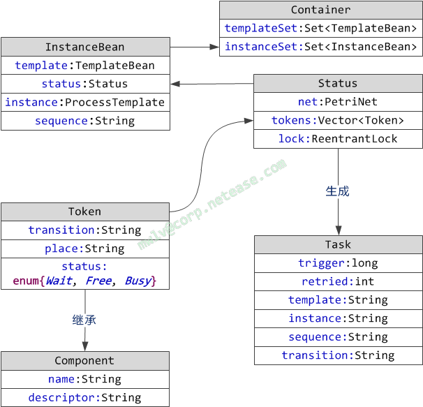

InstanceBean表示一个流程实例，它包含了原始的配置信息instance以及由其生成的TemplateBean对象template，另外还包含一个表示当前petri网状态的Status类型的对象。一个petri网的状态，可以用一组令牌Token来表示，Status对这组令牌进行了封装，并加入一些需要的方法，对这组令牌进行状态控制（如新增，锁定，释放锁定），之后根据当前库所的令牌状态，生成下次模型是否能发生迁移（firing）以及能发生哪些迁移，然后根据迁移生成出将要执行的任务Task，交给再下一层来执行。模型模拟的简单流程如下：

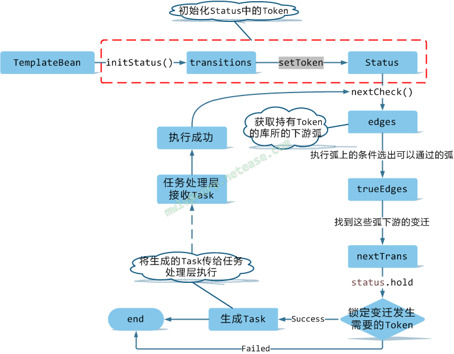


### 4.任务处理层
任务处理层接收来自模型模拟层的任务，按照任务本身的属性来调度执行，执行完成后将执行结果返回到模型模拟层，模型模拟层根据返回的执行结果来对petri网模型进行令牌（Token）的消耗和产生。

在任务处理层有一个调度器Scheduler和一个执行器Executor。

调度器中有一个Task的DelayQueue队列queue，用来存放由模型模拟层生成的Task任务，调度器根据任务的计划执行时间来对队列中所有的任务进行排序，并提供了阻塞方法scheduler()用来将调度器队列queue中到期的任务放进执行器Executor中的排队队列queue中。

如果此次调度任务失败（如，运行器的队列满了），调度器会将调度失败的任务放进自己的失败任务队列failed中。失败队列监控线程会以阻塞的方式从失败队列中取任务，如果取到失败任务，则将任务重新放入调度器自身的queue中。

执行器Executor从自身的BlockingQueue阻塞队列queue中取出调度器之前塞进来的已到期的任务Task，通过Task的描述信息，通过反射方法找到流程配置中对应的应该执行的方法进行执行。

如果执行成功，则返回模型模拟层生成新的下次需要执行的Task，再通过调度器Scheduler的offer()方法将此Task扔给调度器进行后续 调度；如果发生执行器Executor执行失败，或者不满足执行前置条件等情况时，则根据流程配置进行重新调度。

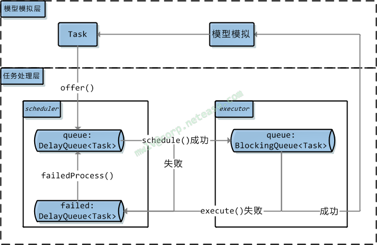

**总结**：引擎的各个层之间相互独立，充分隔离，做到了低耦合，便于之后的替换和扩展。比如：在流程配置层进行的任务流程配置不会影响到底层使用何种模型去模拟，底层也可以去随意更换用作任务调度的模型。

## 五、引擎应用

源码目录结构

```
schedule-all    父项目
├── schedule    调度引擎项目，可编译成jar
└── schedule-sample 示例程序，使用springMVC框架，可使用maven的tomcat插件启动
```

该任务调度引擎以jar包的形式提供，如果项目使用maven构建，在pom中加上如下依赖：


```
<dependency>
    <groupId>com.lede.tech</groupId>
    <artifactId>schedule</artifactId>
    <version>0.0.1-SNAPSHOT</version>
</dependency>
```

在spring的xml配置文件中，引入jar包中的配置文件：


```
<import resource="classpath*:lede-task-schedule.xml"/>
```

然后写一个service类Sample，将四.1节中的流程配置示例类sampleTemplate注入，在初始化函数中启动引擎，加载配置，任务流程就可以执行了。
```
@Service
public class Sample
{
    @Autowired
    ProcessTemplate sampleTemplate;
	
    @PostConstruct
    private void init()
    {
    	Engine.start();
    	Engine.removeFinishedInstance();
    	Engine.initInstance(sampleTemplate);
    }
}
```
---

感谢：

感谢每一位开发和维护过这个项目的同事，谢谢大家！

---
参考文献：

[1] 袁崇义. Petri网原理与应用[M]. 电子工业出版社, 2005.

[2] 吴哲辉. Petri网导论[M]. 机械工业出版社, 2006.

[3] 杨冬芹. 工作流与Petrinet的关系[J]. 硅谷, 2012(17):179-180.

[4] 潘海兰, 吴翠红. Petri网在工作流引擎中的应用分析[J]. 微型电脑应用, 2009, 25(10):37-39.

[5] 王艳玲. 轻量级工作流引擎的设计与实现[D]. 天津理工大学, 2007.